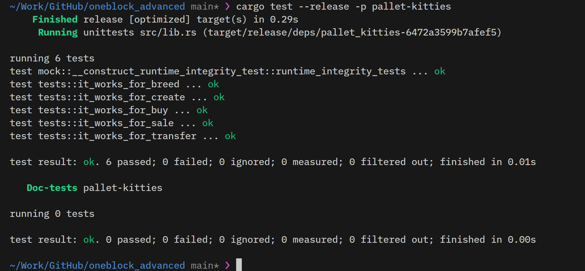
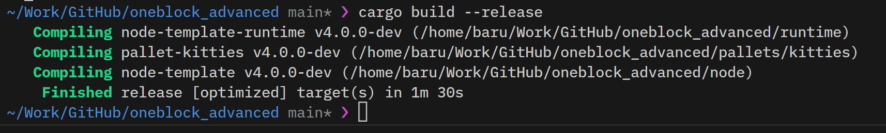
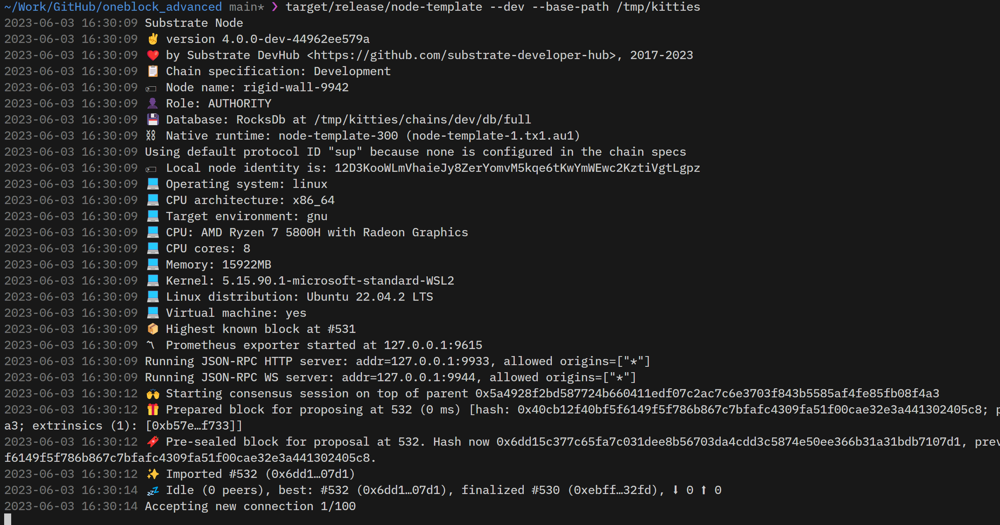
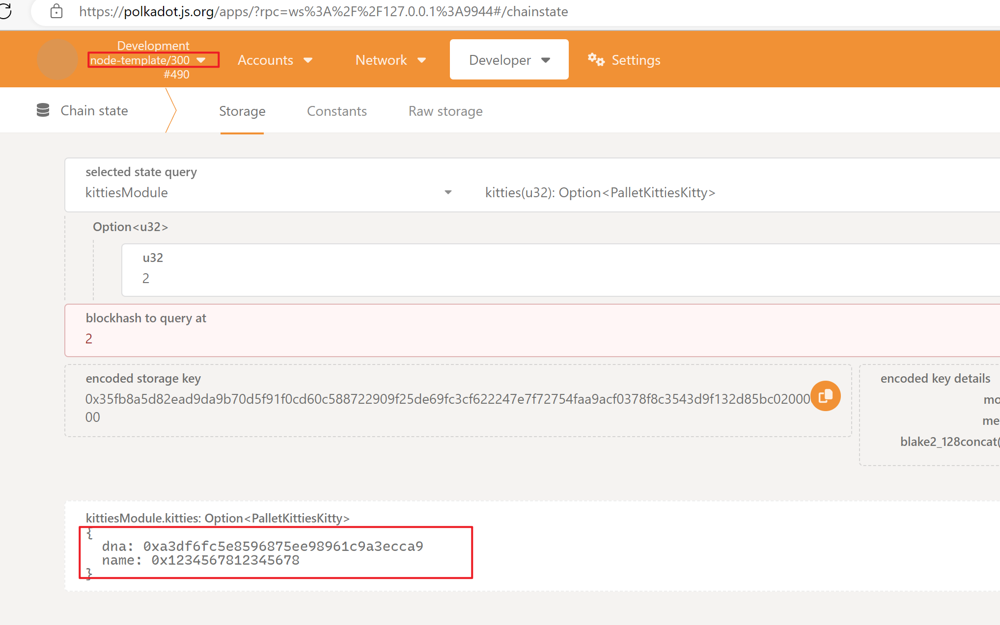
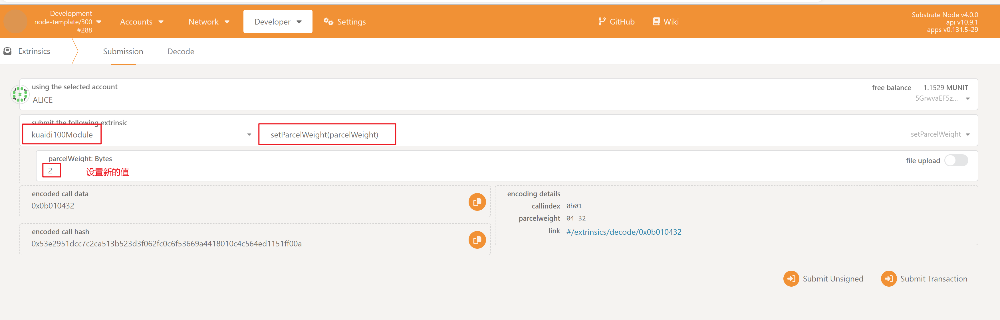
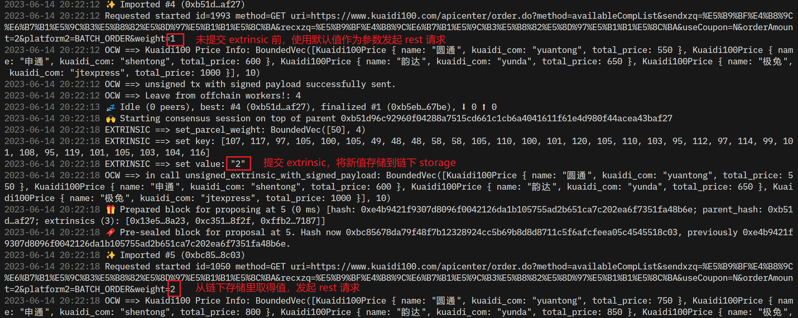
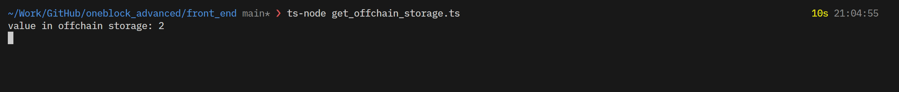
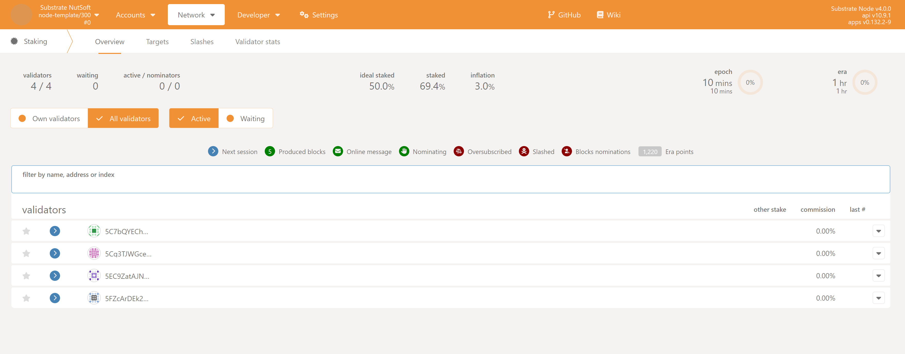
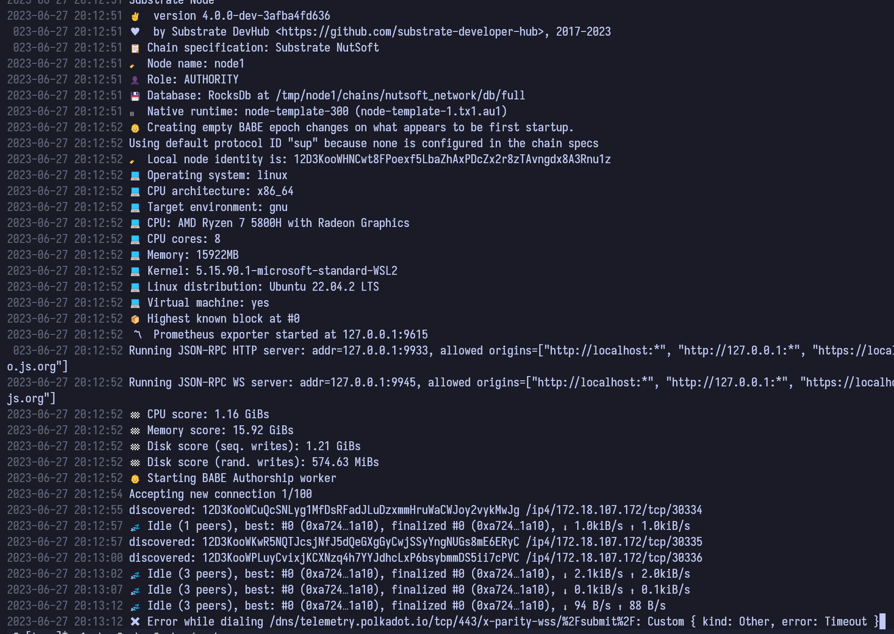
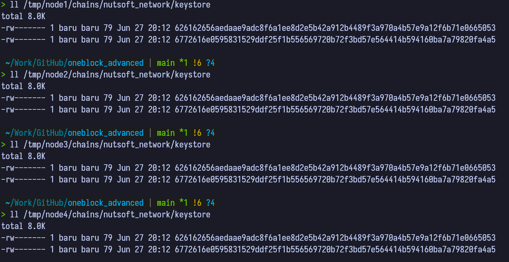

# OneBlock+ 进阶课程作业

## 第一节课作业

### 作业1

编写存证模块的单元测试代码，包括创建存证的测试用例
撤销存证的测试用例
转移存证的测试用例

### 答案：
[pallets/poe/src/tests.rs](./pallets/poe/src/tests.rs)

### 截图：

## 第二节课作业

### 作业1

跟着视频,完成Kitties的开发
* Pallet编译成功
* 单元测试通过
* 加入kitties pallet到runtime中,node可以编译通过
* node节点可以正常启动

### 答案：
[pallets/kitties](./pallets/kitties)

### 截图：

## 第三节课作业

### 作业1

跟着视频,完成Kitties pallet
* 增加 Currency sale/buy 方法后 Pallet 可以编译
* 增加新的测试用例
* 修改 runtime,node可以编译通过
* node节点可以启动

### 答案：
[pallets/kitties](./pallets/kitties)

### 截图：

### 作业2

Runtime 升级
* Kitties palletv2，将 kitties name 扩充到8个字节
* 完成 migration 代码
* 验证从 vO-v2,v1-v2的升级路径

### 答案：
[pallets/kitties](./pallets/kitties)

### 截图：

## 第四节课作业

### 作业

* 在Offchain Worker中，使用Offchain Indexing特性实现从链上向Offchain Storage中写入数据
* 使用 js sdk 从浏览器frontend获取到前面写入Offchain Storage的数据
* 设计一个场景实例（比如获取一个外部的价格信息），实现从OCW中向链上发起带签名负载的不签名交易，并在Runtime中正确处理

### 答案：

后端代码 [pallets/kuaidi100](./pallets/kuaidi100)

前端代码 [front_end](./front_end)
### 截图：

## 第五节课作业

[https://github.com/jiyuan0125/oneblock_advanced_ink](https://github.com/jiyuan0125/oneblock_advanced_ink)

## 第六节课作业

### 作业
* 为 proof of existence (poe) 模块的可调用函数 create_claim, revoke_claim, transfer_claim 添加 benchmark 用例，并且将 benchmark 运行的结果应用在可调用函数上；
* 选择 node-template 或者其它节点程序，生成 Chain Spec 文件（两种格式都需要）；
* （附加题）根据 Chain Spec，部署公开测试网络

### 答案：
1. [pallets/poe/src/benchmarking.rs](./pallets/poe/src/benchmarking.rs)
2. [nutsoft-staging.json](./nutsoft-staging.json) [nutsoft-staging-raw.json](./nutsoft-staging-raw.json)，生成chain spec的脚本在 [scripts](./scripts) 目录里
3. 部署节点的脚本在 [scripts](./scripts) 目录里

**存在的问题：在这个4个验证人的网络里，我部署的节点无法同步区块，不知道是什么原因，所以无法验证部署的节点是否正常工作。**
### 截图：

