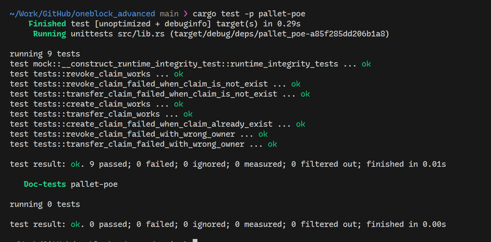
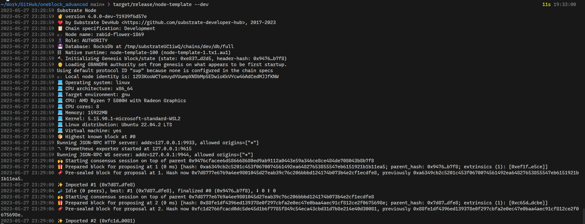
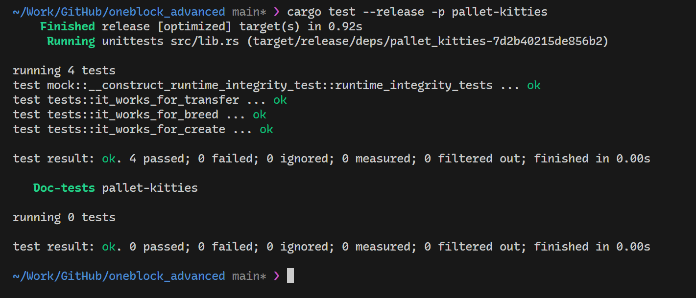

# OneBlock+ 进阶课程作业

## 第一节课作业

### 作业1

编写存证模块的单元测试代码，包括创建存证的测试用例
撤销存证的测试用例
转移存证的测试用例

### 答案：
[pallets/poe/src/tests.rs](./pallets/poe/src/tests.rs)

### 截图：

## 第二节课作业

### 作业1

跟着视频,完成Kitties的开发
* Pallet编译成功
* 单元测试通过
* 加入kitties pallet到runtime中,node可以编译通过
* node节点可以正常启动

### 答案：
[pallets/kitties](./pallets/kitties)

### 截图：

