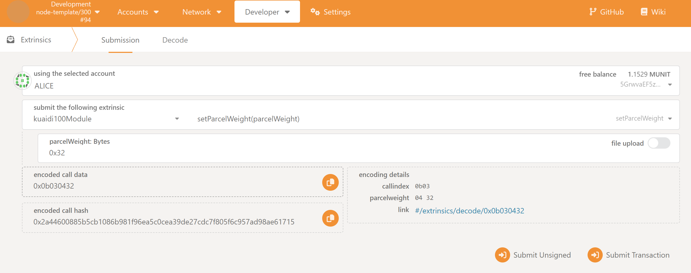

# Oneblock+ 进阶 第4课作业

使用 js sdk 从浏览器frontend获取到前面写入Offchain Storage的数据

运行步骤

1. 安装依赖，并运行。

```
npm install -g typescript
npm install -g ts-node
yarn install
ts-node get_offchain_storage.ts
```

2. 在 apps 上使用 Alice 账号向 Bob 账号转账 10 个 Unit。

